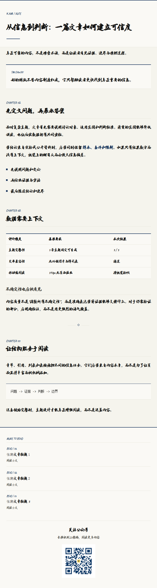
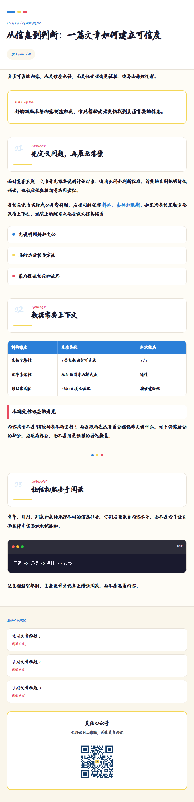
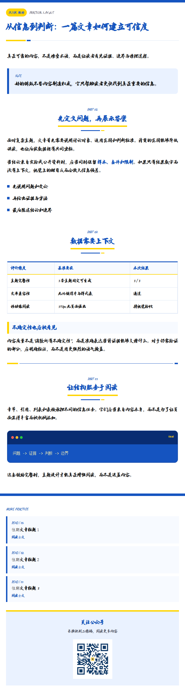

# anything-to-html

将 Word、Markdown 和纯文本转换为微信公众号兼容的全内联 HTML。项目只交付公众号版 `*.wechat.html`。

## 功能

- 固定提供 `kami`、`esther`、`punk` 三套主题
- Word 正文、表格和内嵌图片按文档顺序提取
- Markdown 标题、列表、引用、代码、表格和本地图片转换
- 正文图片与二维码自动转为 base64
- 输出不声明 `font-family`，直接跟随微信公众号阅读端的原生字体
- 固定 677px 页面、组件尺寸和二维码占位，转换前后自动执行版式契约验证

## 使用

```powershell
pip install -r requirements.txt
python scripts/convert.py article.docx --theme kami
python scripts/convert.py article.md --theme esther
python scripts/convert.py article.md --theme punk
python scripts/convert.py --list-themes
```

默认主题是 `kami`。未传入 `--output` 时，输出文件名为 `原文件名_主题名.wechat.html`。

如果没有传入 `--qr`，转换器会使用 `assets/images/qr-placeholder.png` 作为二维码图片占位；传入 `--qr` 时可替换为实际二维码。所有输出都会移除自定义字体声明，以保证粘贴到公众号后台后稳定使用微信原生字体。

## 主题展示

下面的展示图由同一份示例文章稳定生成。三个链接都是可直接粘贴到微信公众号后台的版本。

| 主题 | 风格 | 适合内容 | 公众号版 |
|---|---|---|---|
| **Kami 纸感 · `kami`** | 纸面、章节线、研究归档感 | 研究报告、深度长文、知识归档 | [打开模板](examples/showcase/kami.wechat.html) |
| **Esther 组件 · `esther`** | 圆角卡片、组件编号、轻快配色 | 设计说明、产品拆解、轻松解释 | [打开模板](examples/showcase/esther.wechat.html) |
| **Punk 微排 · `punk`** | 蓝黄工具栏、强分区、步骤清单 | 工具教程、清单、实操步骤 | [打开模板](examples/showcase/punk.wechat.html) |

<table>
<tr>
<td align="center"><strong>Kami 纸感 · kami</strong><br></td>
<td align="center"><strong>Esther 组件 · esther</strong><br></td>
</tr>
<tr>
<td align="center"><strong>Punk 微排 · punk</strong><br></td>
<td align="center"><strong>稳定输出</strong><br><span>固定宽度、固定二维码尺寸、固定页脚结构与确定性 HTML</span></td>
</tr>
</table>

每次构建都写入 `examples/showcase/manifest.json`，其中包含三套公众号模板的文件名、字节数与 SHA-256，便于检查输出是否发生变化。

## 许可证

代码和文档使用 MIT License。第三方资产说明见 `THIRD_PARTY_NOTICES.md`。
