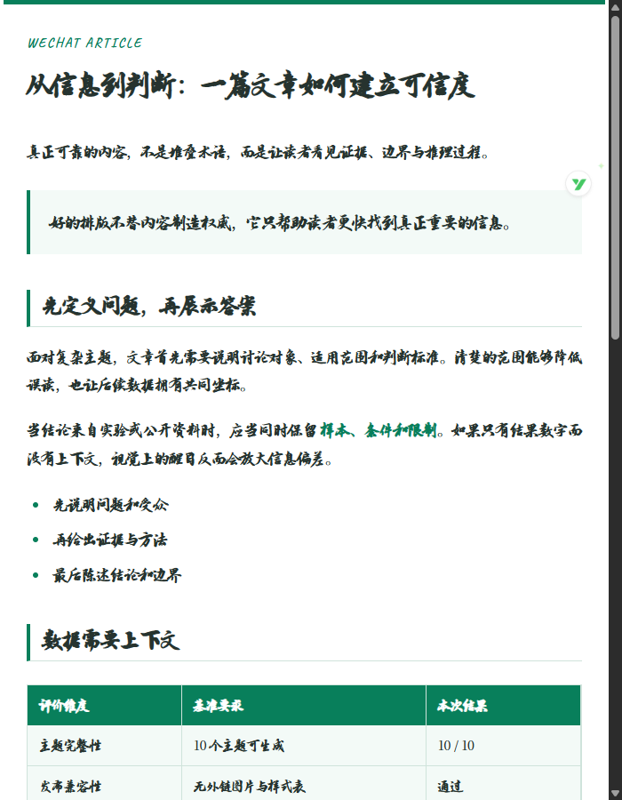
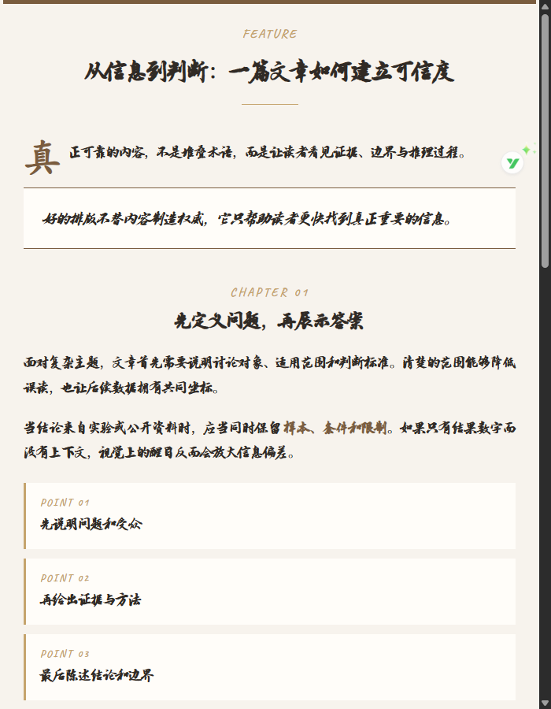
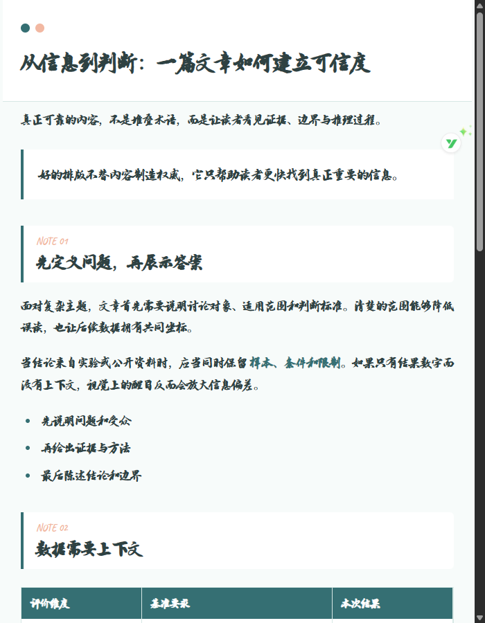
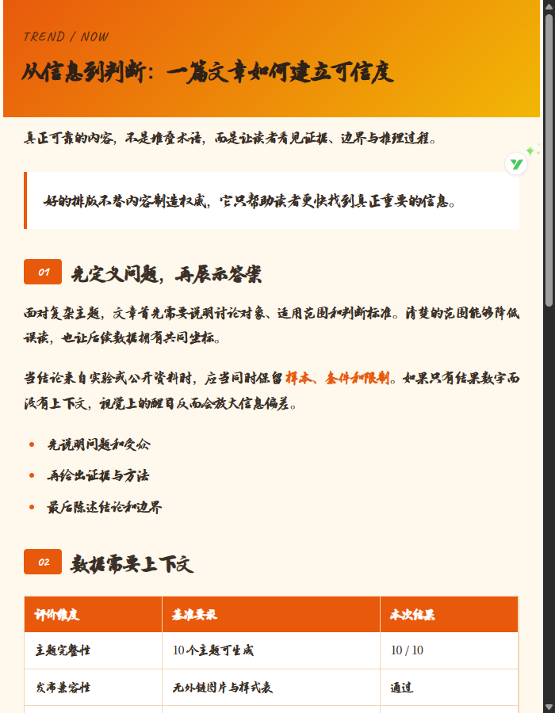
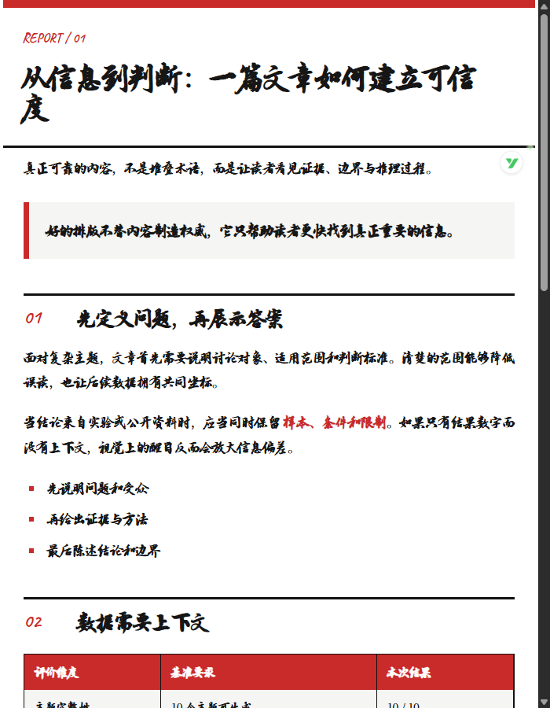
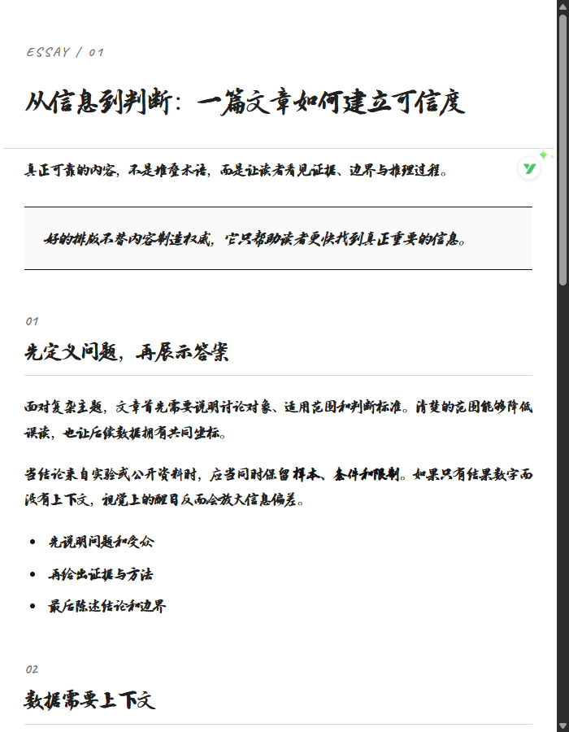
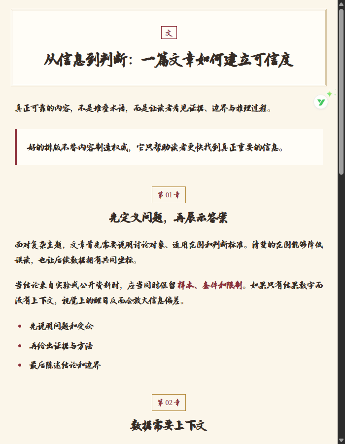
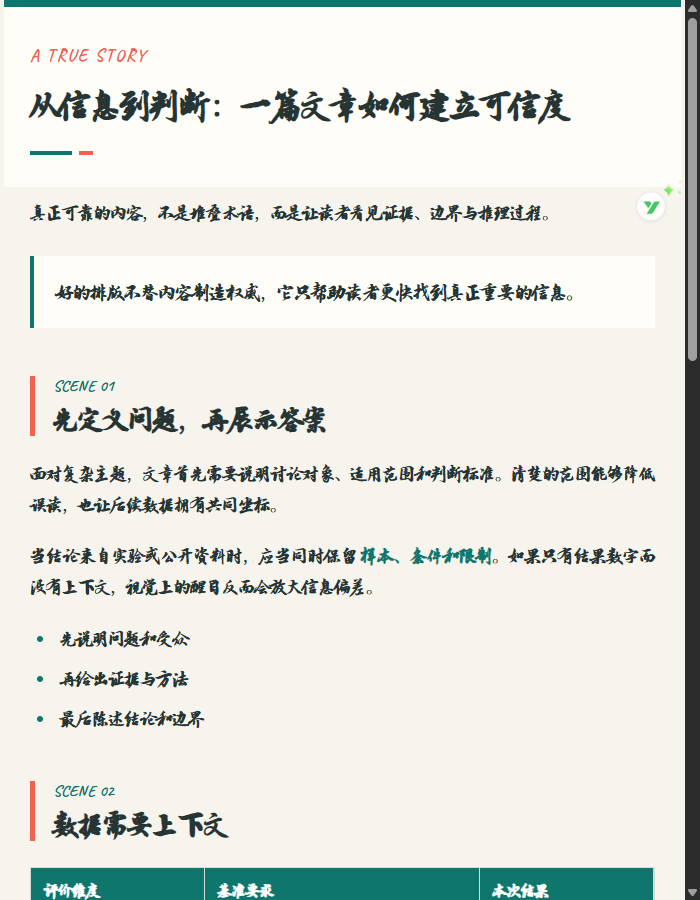
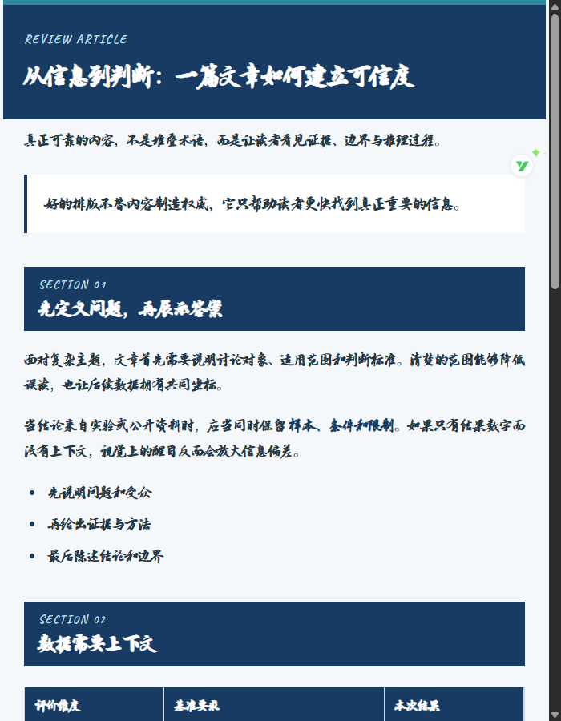
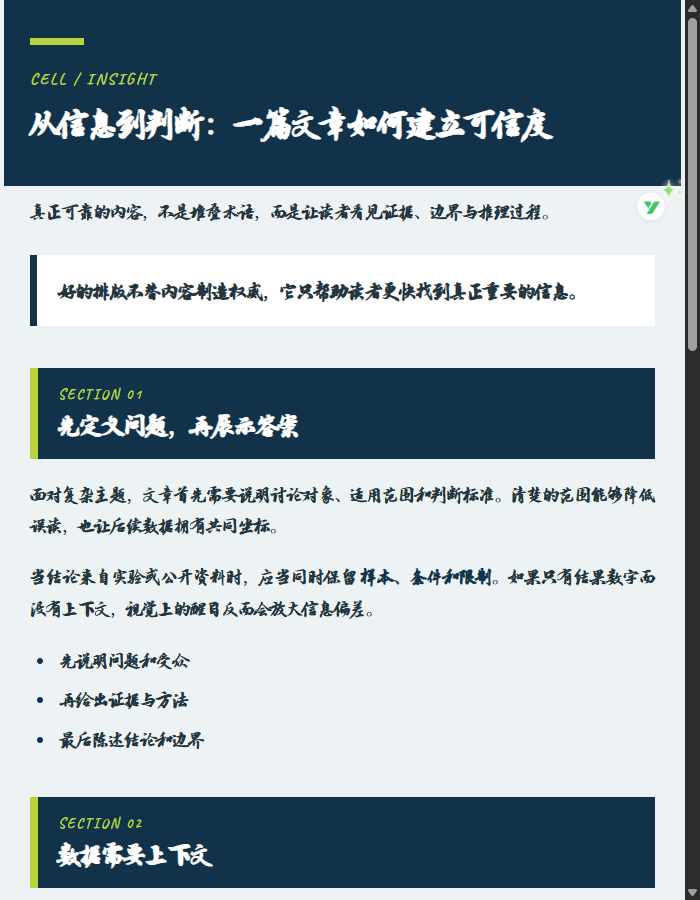

# anything-to-html

将 Word、Markdown 和纯文本转换为微信公众号兼容的全内联 HTML。

## 功能

- 10 个独立主题，兼容旧参数 `orange`、`blue`、`nature` 和 `morandi`
- Word 正文、表格和内嵌图片按文档顺序提取
- Markdown 标题、列表、引用、代码、表格和本地图片转换
- 正文图片与二维码自动转为 base64
- 发布版严格禁止外部 CSS、脚本、网络字体和外链图片
- 本地预览可加载 `Caveat Bold` 与 `XuanZongTi`（玄宗体）字体
- 转换完成后自动执行 HTML 与主题契约验证

## 使用

```powershell
pip install -r requirements.txt
python scripts/convert.py article.docx --theme academic-blue --output article.html
python scripts/convert.py article.md --theme magazine --output article.html
python scripts/convert.py --list-themes
```

本地字体预览：

```powershell
python scripts/convert.py article.md --theme classic --output article.preview.html --preview-fonts
```

转换器会自动计算输出文件到字体目录的相对路径。带 `--preview-fonts` 的文件包含 `<style>@font-face</style>`，仅用于浏览器验收，不能作为微信公众号发布版。

## 主题展示

下面的展示图使用 `Caveat Bold` 与 `XuanZongTi`（玄宗体）本地字体预览版生成；点击“查看 HTML”可以查看对应的发布版 HTML。发布版不含 `<style>`、脚本、外链图片或网络字体，适合复制到微信公众号编辑器。

<table>
<tr>
<td align="center"><strong>经典简约 · classic</strong><br><br><a href="examples/showcase/classic.html">查看 HTML</a></td>
<td align="center"><strong>杂志精品 · magazine</strong><br><br><a href="examples/showcase/magazine.html">查看 HTML</a></td>
</tr>
<tr>
<td align="center"><strong>清新文艺 · fresh</strong><br><br><a href="examples/showcase/fresh.html">查看 HTML</a></td>
<td align="center"><strong>活力橙黄 · vibrant</strong><br><br><a href="examples/showcase/vibrant.html">查看 HTML</a></td>
</tr>
<tr>
<td align="center"><strong>瑞士网格 · swiss</strong><br><br><a href="examples/showcase/swiss.html">查看 HTML</a></td>
<td align="center"><strong>极简学术 · minimal</strong><br><br><a href="examples/showcase/minimal.html">查看 HTML</a></td>
</tr>
<tr>
<td align="center"><strong>中式国风 · chinese</strong><br><br><a href="examples/showcase/chinese.html">查看 HTML</a></td>
<td align="center"><strong>叙事编辑 · narrative</strong><br><br><a href="examples/showcase/narrative.html">查看 HTML</a></td>
</tr>
<tr>
<td align="center"><strong>学术深蓝 · academic-blue</strong><br><br><a href="examples/showcase/academic-blue.html">查看 HTML</a></td>
<td align="center"><strong>Cell 编辑风 · cell</strong><br><br><a href="examples/showcase/cell.html">查看 HTML</a></td>
</tr>
</table>

完整展示清单和每个文件的校验信息见 [`examples/showcase/manifest.json`](examples/showcase/manifest.json)。

## 许可证

代码和文档使用 MIT License。`assets/fonts/` 中的字体由项目使用者提供，不随项目代码重新授权，详见 `THIRD_PARTY_NOTICES.md`。
